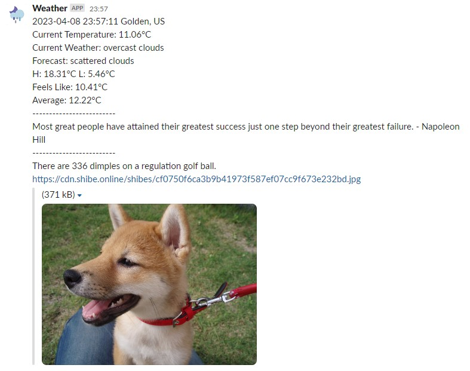

# Slack Fetch Bot

Slack Fetch Bot is a lightweight and easy-to-use Python bot that fetches information from different APIs and sends them as Slack messages. It can be used to schedule messages to send at a specific time or when people mention the bot in a channel.

# Features
Slack Fetch Bot currently supports the following features:

* Weather information: Get weather information for a specified location using the [OpenWeatherMap](https://openweathermap.org/api "Weather API") API.
* Random quotes/facts: Get a random quote or fact using the [Quotable](https://github.com/lukePeavey/quotable "Quotable Github") API or the [uselessfacts](https://uselessfacts.jsph.pl/ "uselessfacts") API.
* Random image of shiba inu: Get a random image of a Shiba Inu dog using the [shibe.online](https://shibe.online/ "shibe.online") API.

# Requirements
To run this project, you will need:
* certifi==2022.12.7
* charset-normalizer==3.1.0
* idna==3.4
* requests==2.28.2
* schedule==1.1.0
* slack-bolt==1.17.0
* slack-sdk==3.21.0
* urllib3==1.26.15

You can install these dependencies using pip with the following command:

```bash
pip install -r requirement.txt
```
*To avoid any potential conflicts with other Python packages, it is strongly recommended to run this command within a virtual environment specific to your project.*

In addition to these packages, you'll need to create a Slack bot and obtain its API token. To do this, follow these steps:

1. Go to the [Slack API website](https://api.slack.com/apps "Slack API") and create a new app.
2. You can follow the steps in the [Slack API documentation](https://api.slack.com/bot-users "Enabling interactions with bots") to create your bot.

or

2. To simplify the deployment of your bot, it is recommended to use a manifest.yml file to define your app's configuration and deploy it to your workspace using the Slack App Manager. A sample manifest.yml file is included in this project.

3. Copy the "Bot User OAuth Access Token" from the "OAuth & Permissions" section of your app settings.
4. From Settings->Basic Information->App-Level Tokens, create && copy a token with a scope of `connections:write`.

# Installation
To install Slack Fetch Bot, follow these steps:

1. Create a new Slack app and bot user on your Slack workspace.
2. Modify your bot's OAuth token in **fetch_bot.py** : `SLACK_APP_TOKEN=your_app_token (xapp-)` and `SLACK_BOT_TOKEN=your_bot_token (xoxb-)`. Optional: You will also need a key to use the Weather API from OpenWeatherMap.
3. (Optional) In order to schedule messages to be sent to a specific Slack channel, you will need [to obtain the channel's ID from Slack](https://feedly.helpscoutdocs.com/article/648-how-to-find-slack-channel-id#:~:text=To%20find%20channel%20ID%20in%20Slack%3A&text=Open%20your%20web%20browser%20and,represents%20your%20Slack%20Channel%20ID.) and add it to the relevant section of the **fetch_bot.py** file.
4. "Customize the bot's functionality by modifying the **fetch_bot.py** file to suit your needs. Don't be afraid to get creative!

# Usage
To start the bot, run the following command:

```bash
python3 fetch_bot.py
```
To stop the app, press Ctrl+C in the terminal.

To run the app in the background, run the following command in the terminal:

```bash
nohup python3 fetch_bot.py &
```

To stop the app, run the following command in the terminal:

```bash
ps -ef | grep fetch_bot.py
kill -9 <process id>
```
Once the bot is running, it will listen for events on your Slack workspace and respond accordingly.

# Example
Once you have set up the **fetch_bot.py** file and have configured the Slack bot, you can use the bot to fetch information and send it to your Slack channel. 



# Contributing
If you'd like to contribute to Slack Fetch Bot, feel free to submit a pull request or open an issue.

# License

Slack Fetch Bot is licensed under the MIT License. See [LICENSE](./LICENSE) for more information.