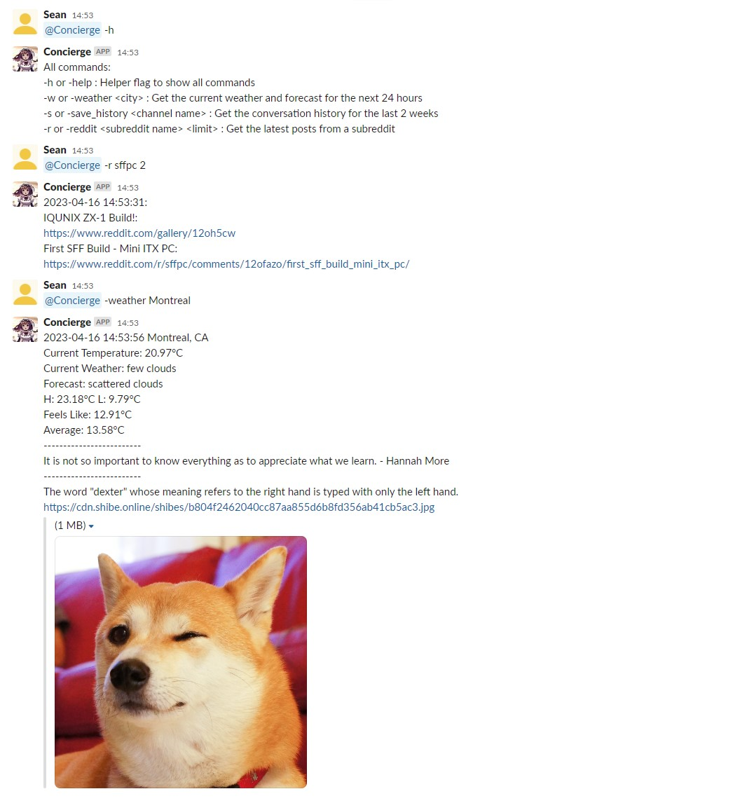

# Slack Fetch Bot

Slack Fetch Bot is a versatile Python bot that can fetch information from different APIs and send them as Slack messages, or save conversation history from a Slack channel to a JSON file. It also includes a feature to convert the JSON file to an HTML file, which can be viewed in any browser and includes all downloaded image files. The bot supports scheduled messages, and can be customized by modifying the `fetch_bot.py` file. Before using the conversation history feature, be sure to add the bot to the desired Slack channel. Additionally, environment variables for the Slack Bot Token, Slack App Token, and OpenWeatherMap API key should be exported. See the `README.md` file for more information.

# Features
Slack Fetch Bot currently supports the following features:

* Weather information: Get weather information for a specified location using the [OpenWeatherMap](https://openweathermap.org/api "Weather API") API.
* Random quotes/facts: Get a random quote or fact using the [Quotable](https://github.com/lukePeavey/quotable "Quotable Github") API or the [uselessfacts](https://uselessfacts.jsph.pl/ "uselessfacts") API.
* Random image of shiba inu: Get a random image of a Shiba Inu using the [shibe.online](https://shibe.online/ "shibe.online") API.
* Retrieve and store conversation history with auto-downloaded image files from Slack based on a given schedule to a JSON file or on request.
* Convert conversation history JSON files to ***HTML format***, which supports for all major browsers


# Conversation History Retrieval
> **Note:** Before requesting the bot to get conversation history, you need to make sure that the bot has been added to the specific channel you want to retrieve the history from. 

The bot can retrieve and store conversation history from Slack based on a given schedule to a JSON file or on request. You are welcome to modify the output format by modifying the `save_history::save_conversation_history()` function. The Slack API endpoint used for this feature is `conversations.history`. More information on this API endpoint can be found in the [official Slack API documentation](https://api.slack.com/methods/conversations.history).

# Requirements
To run this project, you will need:
* certifi==2022.12.7
* charset-normalizer==3.1.0
* idna==3.4
* requests==2.28.2
* schedule==1.1.0
* slack-bolt==1.17.0
* slack-sdk==3.21.0
* urllib3==1.26.15

You can install these dependencies using pip with the following command:

```bash
pip install -r requirement.txt
```
*To avoid any potential conflicts with other Python packages, it is strongly recommended to run this command within a virtual environment specific to your project.*

In addition to these packages, you'll need to create a Slack bot and obtain its API token. To do this, follow these steps:

1. Go to the [Slack API website](https://api.slack.com/apps "Slack API") and create a new app.
2. You can follow the steps in the [Slack API documentation](https://api.slack.com/bot-users "Enabling interactions with bots") to create your bot.

or

2. To simplify the deployment of your bot, it is recommended to use a manifest.yml file to define your app's configuration and deploy it to your workspace using the Slack App Manager. A sample manifest.yml file is included in this project.

3. Copy the "Bot User OAuth Access Token" from the "OAuth & Permissions" section of your app settings.
4. From Settings->Basic Information->App-Level Tokens, create && copy a token with a scope of `connections:write`.

# Installation
To install Slack Fetch Bot, follow these steps:

1. Create a new Slack app and bot user on your Slack workspace.
2. Modify your bot's OAuth token in **fetch_bot.py** : `SLACK_APP_TOKEN=your_app_token (xapp-)` and `SLACK_BOT_TOKEN=your_bot_token (xoxb-)`. Optional: You will also need a key to use the Weather API from OpenWeatherMap.
3. (Optional) The **fetch_bot.py** file includes a commented section in the main class that allows you to schedule messages to be sent to a specific Slack channel. To use this feature, simply uncomment the relevant code and edit it according to your needs.
4. "Customize the bot's functionality by modifying the **fetch_bot.py** file to suit your needs. Don't be afraid to get creative!

# Usage
To start the bot, export the following environment variables with your corresponding values:

```bash
export SLACK_BOT_TOKEN=your_slack_bot_token
export SLACK_APP_TOKEN=your_slack_app_token
export WEATHER_API_KEY=your_weather_api_key
```

Then run the following command:

```bash
python3 fetch_bot.py
```
To stop the app, press Ctrl+C in the terminal.

To run the app in the background, run the following command in the terminal:

```bash
nohup python3 fetch_bot.py &
```

To stop the app, run the following command in the terminal:

```bash
ps -ef | grep fetch_bot.py
kill -9 <process id>
```
Once the bot is running, it will listen for events on your Slack workspace and respond accordingly.

# Example
Once you have set up the **fetch_bot.py** file and have configured the Slack bot, you can use the bot to fetch information and send it to your Slack channel. 

 


# Contributing
If you'd like to contribute to Slack Fetch Bot, feel free to submit a pull request or open an issue.

# License

Slack Fetch Bot is licensed under the MIT License. See [LICENSE](./LICENSE) for more information.